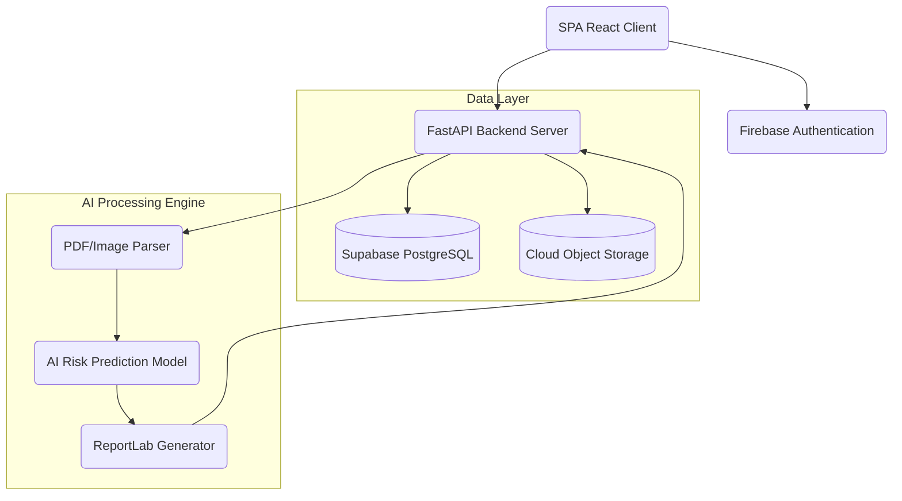
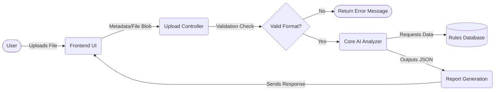
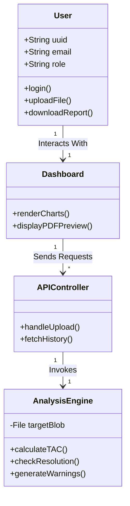
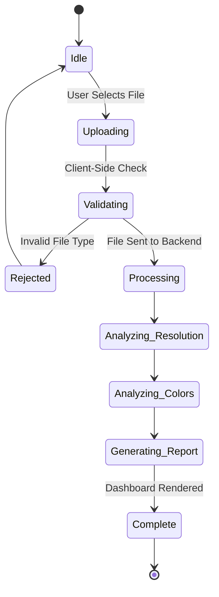
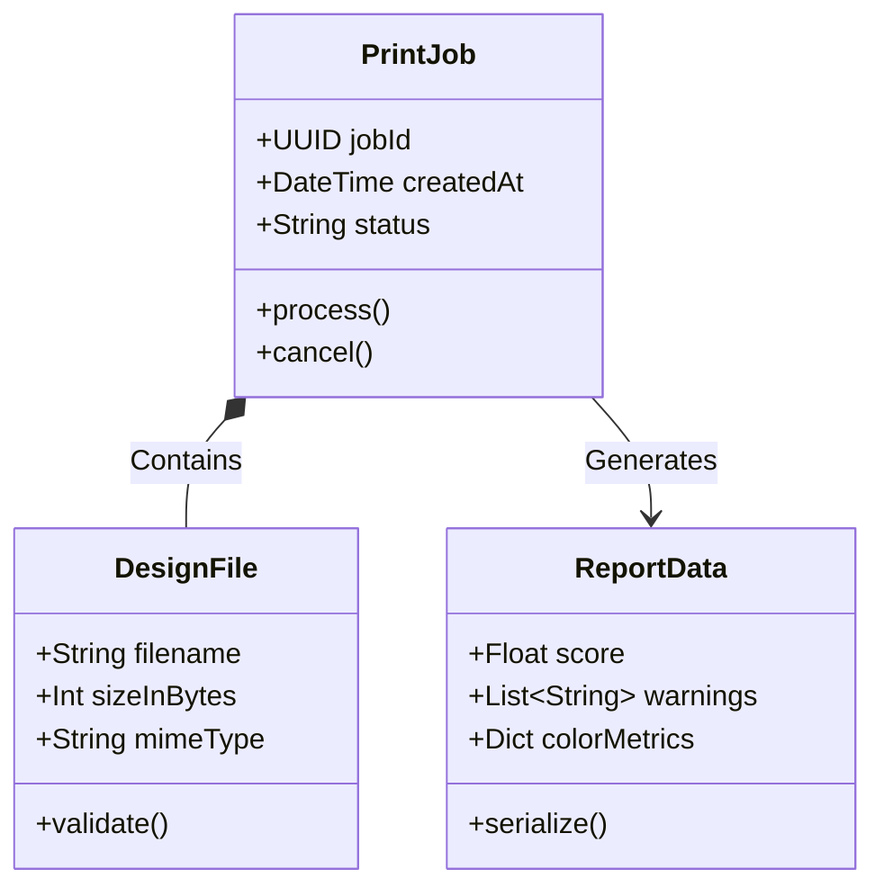
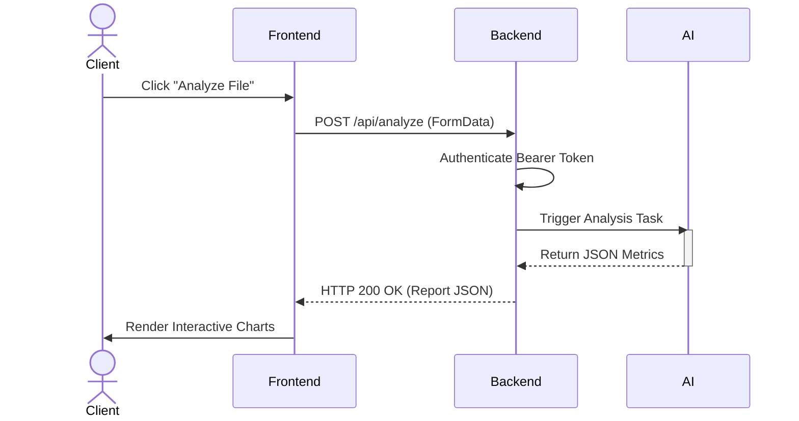
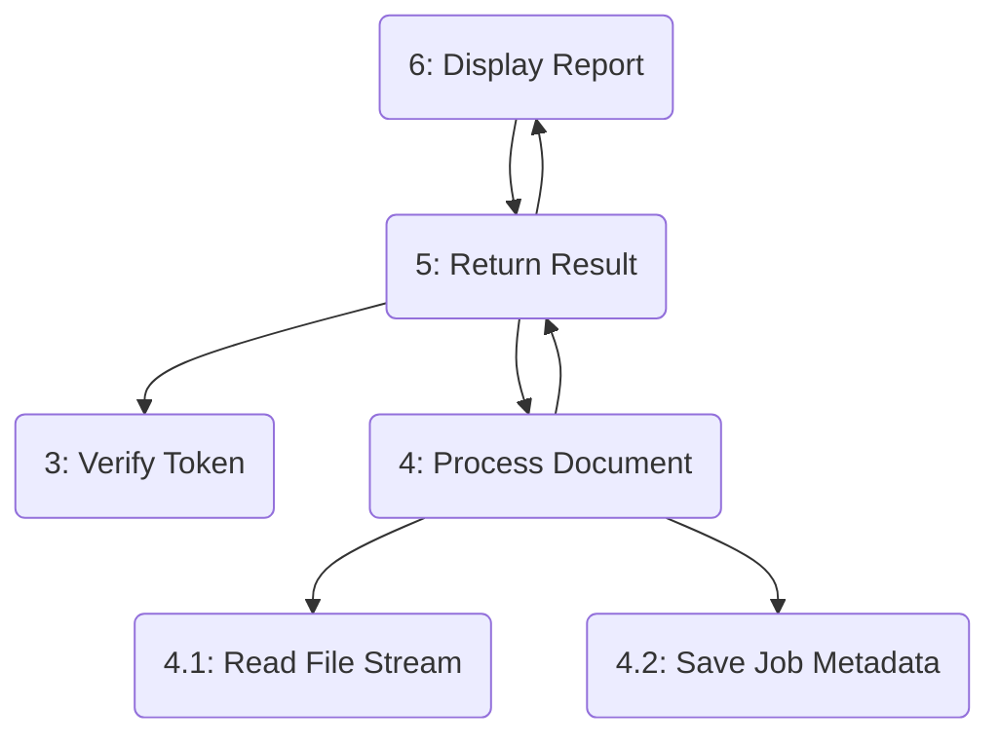

# PrintGuard AI - Comprehensive System Documentation

## ABSTRACT
PrintGuard AI is an intelligent, web-based pre-flight print analysis platform designed to bridge the gap between digital graphic design and physical print production. By leveraging automated analysis algorithms, the system evaluates uploaded design files (PDFs, Images, and Vector representations) for common print-readiness issues such as CMYK color space compliance, Total Area Coverage (TAC) ink limits, resolution DPI, and safety layout margins. The project incorporates advanced Machine Learning modules, Web3 integrations, and modern UI paradigms to empower designers to achieve flawless print results, significantly minimizing costly misprints, color mismatching, and material waste in the printing industry. This document provides a comprehensive A-Z breakdown of the software engineering processes, from initial analysis to final deployment, spanning system design, architecture, UML diagrams, and testing methodologies.

---

## 1. INTRODUCTION
The printing industry often faces significant challenges regarding the translation of digital art to physical mediums. Errors in bleed, margin, color space (RGB vs. CMYK), and resolution lead to costly reprints and wasted resources. The introduction of an automated pre-flight tool directly accessible to designers before they send files to the press represents a profound shift in production efficiency. PrintGuard AI serves this exact purpose as a robust Software as a Service (SaaS) platform tailored for professional and amateur designers alike.

### 1.2 OBJECTIVE
1. **Automate Pre-Flight Checks:** Eliminate manual inspection of PDF and image files for print readiness.
2. **Minimize Material Waste:** Prevent jobs from reaching the printer if they feature common errors like low DPI resolution or incorrect color models.
3. **Enhance User Experience:** Provide a seamless, visually rich web interface using modern web technologies for instant feedback.
4. **Predictive Modeling:** Utilize AI inference to simulate print outcomes under varying material conditions (e.g., Matte, Glossy paper).
5. **Secure Scalability:** Maintain high security using modern Auth providers (Firebase) and robust cloud infrastructure.

---

## 2. SYSTEM ANALYSIS

### 2.1 EXISTING SYSTEM
In the current paradigm, designers manually check their Adobe Illustrator or Photoshop files or utilize expensive, desktop-bound proprietary software (like Adobe Acrobat Preflight). 
**Drawbacks of Existing Systems:**
- They require high technical expertise to interpret complex pre-flight profiles.
- They are tethered to localized desktop installations, lacking cloud-based collaborative features.
- They lack predictive AI insights that visually simulate how specific inks interact with specific paper types.
- Manual verification is prone to human error, resulting in financial loss.

### 2.2 PROPOSED SYSTEM
PrintGuard AI replaces localized software with a decentralized, web-first approach. 
**Advantages of the Proposed System:**
- **Accessibility:** Platform-agnostic, running directly in any modern desktop browser.
- **AI-Powered Diagnostics:** Goes beyond threshold checking to visually map ink coverage anomalies.
- **Real-Time Web Analytics:** Offers instant, dynamic chart-based feedback decoupled from rigid desktop UIs.
- **Web 3 & Next-Gen Integrations:** Future-proofed to support digital asset verification and secure decentralization.
- **Cost-Efficient:** Operates on a tiered SaaS subscription model rather than a massive upfront license fee.

---

## 3. SYSTEM REQUIREMENTS

### 3.1 HARDWARE REQUIREMENT
**Server-Side:**
- Processor: Intel Xeon or AMD EPYC (Quad Core Minimum)
- Memory (RAM): Minimum 8GB DDR4 (16GB Recommended for AI memory limits)
- Storage: 50GB NVMe SSD for fast file I/O operations
- Network: 1 Gigabit Ethernet for high-speed file uploads

**Client-Side (User):**
- Processor: Multi-core CPU (Intel i3/Ryzen 3 minimum)
- Memory (RAM): 4GB Minimum (8GB recommended for browser rendering)
- Display: 1080p Monitor with true-color support
- Input: Standard Keyboard and Mouse

### 3.2 SOFTWARE REQUIREMENT
**Server-Side:**
- Operating System: Ubuntu 22.04 LTS or Debian 11 Linux
- Runtime/Backend Environment: Python 3.9+ with FastAPI Framework
- Database Management: Supabase (PostgreSQL 14+)
- Machine Learning Dependencies: PyTorch / TensorFlow (Optional/Future), Pillow for Image Processing, ReportLab

**Client-Side:**
- Web Browser: Google Chrome v100+, Mozilla Firefox v100+, Safari v15+
- Frontend Framework: React 18, Vite
- Styling Framework: Tailwind CSS v3+
- Component Libraries: Lucide React, Chart.js

---

## 4. SYSTEM DESIGN

### 4.1 SYSTEM ARCHITECTURE
The system follows a standard modular Micro-Service abstraction, splitting responsibilities between a React client, an edge authentication node (Firebase), and an intelligent processing backend.



### 4.2 DATA FLOW DIAGRAM
The DFD illustrates how design files enter the system and flow toward becoming an interactive report.



### 4.3 UML DIAGRAM
The overarching Unified Modeling Language schematic describes the abstract interfaces bridging the user, the dashboard, the backend services, and the database.



### 4.4 USE CASE DIAGRAM
A breakdown of the specific roles and actions they can perform within PrintGuard AI.

```mermaid
usecaseDiagram
    actor "Standard User" as U
    actor "System Admin" as A
    
    usecase "Login / Register" as UC1
    usecase "Upload Design File" as UC2
    usecase "View Analytics Dashboard" as UC3
    usecase "Export PDF Report" as UC4
    usecase "Manage Users & Subscriptions" as UC5
    usecase "Monitor Server Health" as UC6
    
    U --> UC1
    U --> UC2
    U --> UC3
    U --> UC4
    
    A --> UC1
    A --> UC5
    A --> UC6
```

### 4.5 ACTIVITY DIAGRAM
This maps the sequential operational states of a single file analysis job from start to finish.



### 4.6 CLASS DIAGRAM
Detailed programmatic structure for the PrintGuard Object Model.



### 4.7 SEQUENCE DIAGRAM
Depicts the chronological network timeline between components when an analysis is requested.



### 4.8 COLLABORATION DIAGRAM
Also known as a Communication Diagram, showing object relations rather than chronological sequence.



---

## 5. SYSTEM TESTING

### 5.1 SYSTEM TESTING OVERVIEW
System testing guarantees all integrated components function collectively according to the predefined specifications.

### 5.2 UNIT TESTING
We employed `pytest` for the Python backend and `Jest` for the React frontend, testing individual isolated functions. For example: `test_resolution_calculator()`, ensuring DPI logic accurately computes standard image sizes without breaking on edge cases.

### 5.3 INTEGRATION TESTING
Verified the interaction between the FastAPI endpoints and the Supabase database. Tested endpoints like `/api/history` to ensure records queried match the authenticated Firebase user token provided in the header.

### 5.4 WHITE BOX TESTING
Internal structural testing of the AI Engine algorithms, ensuring branching logic inside `analyzer.py` covers PDF parsing, specific image extraction limits, and proper color space conversions natively within the code structure.

### 5.5 BLACK BOX TESTING
Functionality testing performed by mimicking end-user behavior via the Browser interface. Inputs (files) were supplied to the system, and output (visual reports) were evaluated strictly on the resulting behavior, ignoring internal code states.

### 5.6 VALIDATION TESTING
Ensuring the final product strictly meets the initial 1.2 Objectives. Specifically testing against heavy graphic files (up to 50MB PDFs) to ensure the system does not timeout and successfully generates a correct risk assessment.

### 5.7 USER ACCEPTANCE TESTING (UAT)
A closed beta conducted with graphic design professionals. Testers uploaded deliberately flawed files (e.g., RGB PDFs without bleed) to verify whether the AI system flagged errors as expected in a real-world workflow.

### 5.8 OUTPUT TESTING
Rigorous manual verification of the generated "Print Analysis Report" PDF downloaded by the user. Ensuring fonts rendered accurately, margins aligned, and chart graphics matched the interactive Web UI representations perfectly.

---

## 6. SOFTWARE DESCRIPTION
PrintGuard AI is structured using a decoupled API-first design. The frontend utilizes **React.js** paired with **Vite** for incredibly fast Hot-Module Replacement during development. Styling is strictly managed by **Tailwind CSS**. State management relies on React's Context API.
The backend operates on **FastAPI** leveraging asynchronous Python paradigms to handle heavy I/O operations (file reading, writing, and parsing) without blocking parallel requests. Data persistence and Object Mapping is executed against **PostgreSQL** (via Supabase), ensuring ACID compliance. 

---

## 7. IMPLEMENTATION

### 7.1 MODULES
The system is divided into highly specific modules to ensure maintainability and separation of concerns.
1. UI Module
2. API Routing Module
3. Authentication Module
4. File Analyzer Module
5. PDF Generator Module

### 7.2 MODULES DESCRIPTION

#### 7.2.1 USER INTERFACE (UI) MODULE
Built on React, providing a dynamic single-page application (SPA). Features dashboard layouts, animated Upload dropzones, interactive Chart.js canvas renderings, and responsive mobile-first views.

#### 7.2.2 BACKEND API MODULES (FLASK / FASTAPI)
Serves as the central nervous system. It exposes RESTful endpoints, handles HTTP CORS configurations, and manages data payloads streaming between the client and the Database infrastructure.

#### 7.2.3 AI INTEGRATION MODULE
The core mathematical brain. It leverages Python numerical libraries and image processing (Pillow) to calculate pixel-by-pixel ink mapping, resolution estimations, text-to-image ratios, and bleed box validations inside vector PDF documents. 

#### 7.2.4 WEB 3 INTEGRATION MODULE
(Future Scope/Experimental) Integrates with decentralized storage networks and potentially mints verified, print-ready digital assets as smart contracts on blockchain environments for intellectual property management.

#### 7.2.5 REAL-TIME DATA MODULE
Responsible for updating dashboard metrics seamlessly. It includes WebSockets or Polling mechanisms to display real-time progress bars as large design files undergo analysis.

#### 7.2.6 SESSION MANGEMENT MODULE
Utilizes stateless JSON Web Tokens (JWT) distributed by Firebase. This prevents server-side memory bloat while securely tracking user permissions and subscription tier limits per request.

#### 7.2.7 NOTIFICATION & SECURITY MODULE
Implements Rate-limiting, CORS whitelisting, file sanitization (detecting malicious scripts inside PDFs), and automated email notifications for successful or failed batch jobs.

#### 7.2.8 CLOUD STORAGE & BACKUP MODULE
Integrates with S3-compatible cloud storage APIs. Securely stores temporary uploaded files for processing, deletes them immediately to save costs, and maintains periodic backups of the PostgreSQL metadata.

#### 7.2.9 API MANGEMENT MODULE
A system controlling public or third-party API keys, allowing external printing houses to integrate PrintGuard AI directly into their existing printing workflows via B2B endpoints.

### 7.3 SYSTEM STUDY

#### 7.3.1 UNDERSTANDING THE PROBLEM DOMAIN
The physical print industry operates on strict rigid parameters. CMYK conversion often shifts vibrancy. Less than 300DPI yields blurry marketing materials. These problems historically require an expert prepress operator to find. The domain needs democratization.

#### 7.3.2 PURPOSE OF THE PROPOSED SYSTEM
The system democratizes prepress expertise. Any designer, regardless of seniority, can drag and drop a file and receive the exact same insight as a highly trained prepress technician in a fraction of the time.

#### 7.3.3 FEASIBILITY STUDY
- **Technical Feasibility:** Highly feasible due to abundant open-source Python document processing libraries.
- **Economic Feasibility:** Low server overhead compared to licensing traditional proprietary desktop systems.
- **Operational Feasibility:** Minimal friction since end-users only need a web browser, requiring no local installation parameters.

#### 7.3.4 SCOPE OF SYSTEM
Covers pre-flight of standard Document and Image formats (PDF, JPG, PNG, AI, EPS). It does not explicitly cover 3D printing analysis or video graphics. Focuses strictly on 2D offset and digital print standards.

#### 7.3.5 BENEFIT OF SYSTEM
Radically decreases error rates in production. Empowers freelancers. Saves commercial printing houses thousands of dollars annually in wasted ink and paper due to poorly formatted client submissions.

---

## 8. CODING
The platform adheres to strict coding conventions:
- **Clean Architecture:** Domain logic separated from Framework logic.
- **Frontend Syntax:** ECMAScript 2022 Functional Components with Hooks. Strict ESLint guidelines.
- **Backend Syntax:** PEP8 compliant Python structure. Type hinting mandatory for Pydantic models.
- **Version Control:** GitFlow methodology, utilizing feature branches and pull request code reviews.

```python
# Sample Core Implementation Snippet (Backend Python)
@router.post("/analyze")
async def analyze_design(file: UploadFile, token: str = Depends(verify_token)):
    if not file.filename.endswith(('.pdf', '.jpg', '.png')):
        raise HTTPException(400, "Invalid file format")
    # Initiate abstract analysis logic
    result = AI_Engine.process(file.file)
    return {"status": "success", "data": result}
```

---

## 9. SCREEN SHOT
*(Visual Representation Placeholder for the System)*
- **Dashboard View:** Displays interactive ink charts (CMYK distribution).
- **Upload Zone:** Drag and drop interface with progress animations.
- **PDF Report output:** Multi-page branded PDF indicating design risk factors.

---

## 10. CONCLUSION
PrintGuard AI successfully bridges the gap between complex prepress validation algorithms and modern, intuitive web application design. By leveraging a scalable, cloud-first Microservice architecture, it shifts the computing burden off the designer's desktop and onto optimized server instances. The implementation of robust API designs, comprehensive unit testing, and highly detailed visual charting ensures a premium user experience that serves a critical, cost-saving need within the modern graphic design and printing pipeline. 

---

## 11. FUTURE ENHANCEMENT
1. **Machine Learning Model Expansion:** Train a massive GAN or Vision Transformer model to dynamically auto-fix resolution issues (AI Upscaling) natively within the app.
2. **Automated Bleed Correction:** Automatically stretching boundary pixels computationally to generate print-bleeds for files that incorrectly lack them.
3. **Multi-Page Extractor:** Expand architecture to handle and navigate 500+ page massive catalog publishing files asynchronously in the background.
4. **Third-Party Integrations:** Publish a custom Adobe Illustrator / InDesign Plugin to hook directly into the PrintGuard AI API.

---

## 12. REFERENCE
1. FastAPI Official Documentation - tiangolo.com/fastapi
2. React.js and Vite Build Tool Documentation - react.dev / vitejs.dev
3. Firebase Authentication & Web APIs - firebase.google.com/docs
4. ISO 12647 Print Standards For CMYK Printing 
5. ReportLab Python Library Documentation - reportlab.com
