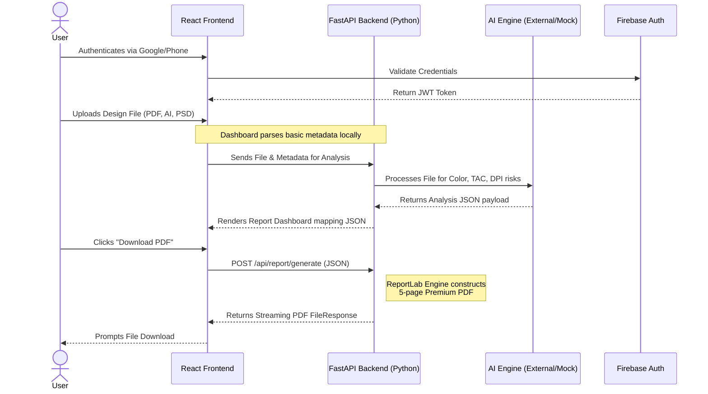
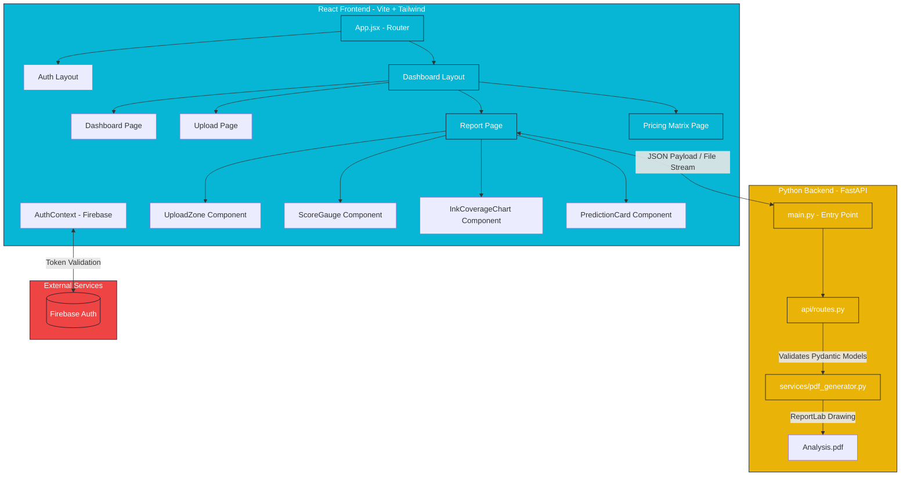

# PrintGuard AI System Architecture

This document outlines the high-level architecture, data flow, and component structure for the PrintGuard AI SaaS platform.

## High-Level System Flow

## Component Architecture

## Infrastructure Tech Stack

**Frontend Layer:**
*   **Framework:** React 18 (Vite)
*   **Routing:** React Router DOM v6
*   **CSS Framework:** Tailwind CSS v3.4 (Custom Navy/Cyan Theme)
*   **Charting Visualization:** Chart.js + react-circular-progressbar
*   **Icons:** Lucide React

**Backend Core / AI Engine:**
*   **API Framework:** FastAPI (Python 3.x)
*   **PDF Generation:** ReportLab
*   **Data Validation:** Pydantic
*   **Image Processing:** Pillow (PIL)

**Infrastructure & Services:**
*   **Authentication:** Firebase Auth (Google Sign-In, Phone OTP with Invisible reCAPTCHA)
